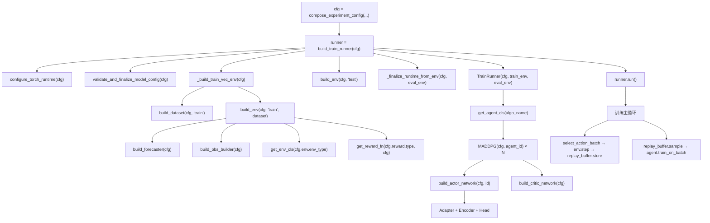
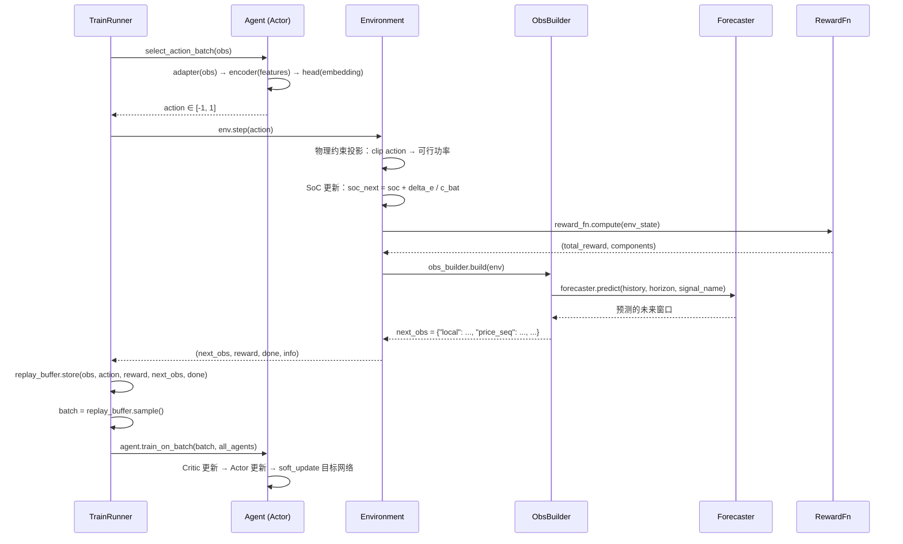

# MADRL_ESS — 多智能体深度强化学习分布式储能控制框架

> **Multi-Agent Deep Reinforcement Learning for Energy Storage Systems**

本项目实现了一套完整的多智能体深度强化学习（MADRL）框架，用于在配电网中调度多台分布式电池储能系统（ESS）的充放电策略，目标是在满足电网约束（电压、线路负载）的前提下，最小化用户的用电成本。

```
多个电池智能体（Agent）              配电网
┌──────┐  ┌──────┐  ┌──────┐       ┌─────────────┐
│Agent0│  │Agent1│  │Agent2│  ───→  │ 潮流约束检查 │
│ 充/放 │  │ 充/放 │  │ 充/放 │       │ (pandapower) │
└──┬───┘  └──┬───┘  └──┬───┘       └──────┬──────┘
   │         │         │                   │
   └────────┼─────────┘                   │
            │                              │
     ┌──────▼──────────────────────────────▼──────┐
     │        MADRL 训练框架 (MADDPG / MATD3)       │
     │  集中训练（Critic 看全局）分散执行（Actor 看局部）│
     └────────────────────────────────────────────┘
```

---

## 目录

- [快速开始](#快速开始)
- [为什么代码要拆成这么多文件？](#为什么代码要拆成这么多文件)
- [代码地图](#代码地图)
- [模块详解](#模块详解)
  - [configs/ — 实验配置](#configs--实验配置菜单)
  - [data/ — 数据加载](#data--数据加载食材)
  - [envs/ — 强化学习环境](#envs--强化学习环境厨房)
  - [predictors/ — 预测器](#predictors--预测器天气预报员)
  - [models/ — 神经网络组件](#models--神经网络组件厨师的工具)
  - [controllers/ — 控制策略](#controllers--控制策略厨师)
  - [scripts/ — 训练评估与工具](#scripts--训练评估与工具流水线)
- [核心流程详解](#核心流程详解)
  - [从配置到训练完成](#1-从配置到训练完成完整调用链)
  - [单步交互流程](#2-单步交互流程一个-timestep-内发生了什么)
  - [神经网络组装流程](#3-神经网络组装流程)
- [扩展指南](#扩展指南)
  - [添加新的 RL 环境](#1-添加新的-rl-环境)
  - [修改/添加神经网络架构](#2-修改添加神经网络架构)
  - [修改/添加奖励函数](#3-修改添加奖励函数)
  - [添加新的 RL 算法](#4-添加新的-rl-算法)
  - [添加新的数据加载器](#5-添加新的数据加载器)
  - [添加新的预测器](#6-添加新的预测器)
- [测试](#测试)
- [技术栈](#技术栈)
- [常见问题](#常见问题)

---

## 快速开始

### 1. 安装依赖

```bash
pip install -r requirements.txt
```

> 如果你有 NVIDIA GPU，确保安装了与 `torch==2.10.0+cu128` 匹配的 CUDA 驱动。
> 没有 GPU 也能运行，框架会自动退回 CPU。

### 2. 运行最小训练

打开 [notebooks/madrl/train_madrl.ipynb](notebooks/madrl/train_madrl.ipynb)，执行所有 cell。你会看到：
- 配置摘要（算法、模型、环境参数）
- 训练进度条（avg_reward 逐步上升）
- 学习曲线和 episode 回放图

### 3. 查看训练产物

训练完成后，产物保存在 `artifacts/` 下：
- `artifacts/training/checkpoints/` — 模型权重
- `artifacts/training/tensorboard/` — TensorBoard 日志（用 `tensorboard --logdir artifacts/training/tensorboard` 查看）

---

## 为什么代码要拆成这么多文件？

如果你以前只写过"面条代码"（所有逻辑堆在一个文件里），看到本项目几十个 `.py` 文件可能会困惑。这一节解释**为什么这样做**，以及**这样做的好处**。

### 类比：乐高积木 vs 一坨黏土

面条代码就像一坨黏土 —— 所有东西混在一起，想换掉一小块就得把整坨拆开重捏。而模块化代码就像乐高积木 —— 每块积木职责单一，想换一块直接拔下来换上新的，其他积木不受影响。

在本项目中，这意味着：
- 想换一个新的神经网络？只改 `models/encoders/` 下的一个文件，其他代码**零修改**
- 想加一种新的奖励函数？只在 `envs/rewards/` 下加一个文件，注册一下就能用
- 想用新的数据集格式？只在 `data/loaders/` 下加一个文件，训练代码**完全不动**

### 本项目使用的三个关键设计模式

#### 模式 1：注册表模式（Registry Pattern）

**问题**：如果用 `if-else` 判断使用哪个类，每次新增一种类型都要去改核心代码的 `if-else` 链。

**解法**：用一个字典（注册表）存储 `名字 → 类` 的映射，新增类型只需往字典里加一条。

```python
# envs/registry.py — 环境注册表
ENV_REGISTRY = {
    "energy_storage": EnergyStorageEnv,  # 基础 HEMS 环境
    "grid_pf":        GridEnv,           # 带电网潮流的环境
}

def get_env_cls(name: str) -> type:
    """通过名字查找环境类，找不到就报错。"""
    return ENV_REGISTRY[name]
```

本项目中有 **6 个注册表**：
| 注册表 | 位置 | 注册的是什么 |
|--------|------|------------|
| `ENV_REGISTRY` | `envs/registry.py` | 环境类 |
| `AGENT_REGISTRY` | `controllers/madrl/registry.py` | RL 算法类 |
| `REWARD_REGISTRY` | `envs/rewards/__init__.py` | 奖励函数类 |
| `FORECASTER_REGISTRY` | `predictors/registry.py` | 预测器类 |
| `DATASET_REGISTRY` | `data/loaders/registry.py` | 数据集类 |
| `ADAPTER/ENCODER/HEAD_REGISTRY` | `models/registry.py` | 神经网络组件类 |

#### 模式 2：工厂函数（Factory / Builder）

**问题**：创建一个环境需要先创建数据集、再创建奖励函数、再创建预测器……手动拼装很繁琐且容易出错。

**解法**：用一个 `build_xxx(cfg)` 函数，把"根据配置创建对象"的逻辑封装起来。

```python
# scripts/builder.py — 你只需要调用一行
runner = build_train_runner(cfg, seed=42)
runner.run()  # 开始训练

# 而在内部，build_train_runner 帮你做了：
# 1. 构建训练数据集 → build_dataset(cfg, mode="train")
# 2. 构建预测器     → build_forecaster(cfg)
# 3. 构建环境       → build_env(cfg, ...)
# 4. 构建所有 Agent  → get_agent_cls("MADDPG")(cfg, agent_id)
# 5. 创建 TrainRunner 并返回
```

#### 模式 3：配置驱动（Config-driven）

**问题**：参数写死在代码里，每次实验改参数就要改源码，而且不同实验的参数混在一起。

**解法**：把所有参数集中到一个配置对象（`ExperimentConfig`）中，代码只读配置、不硬编码参数。

```python
# 在 notebook 中一行切换实验设置：
cfg = compose_experiment_config(
    profile="debug",          # 训练规模：小批量快速调试
    algorithm="MADDPG",       # 算法：MADDPG
    model_family="mlp",       # 网络：MLP
    forecast_type="perfect",  # 预测器：完美预知（Oracle）
)
# 想换 Transformer？只改一个参数：
cfg = compose_experiment_config(model_family="transformer", ...)
```

### 好处总结

| 面条代码 | 本项目的模块化代码 |
|---------|-----------------|
| 改一个地方，到处冒 bug | 改一个模块，其他模块不受影响 |
| 新增功能要在大文件里到处插代码 | 新增一个小文件 + 注册一行 |
| 很难多人协作 | 不同人改不同模块，互不冲突 |
| 无法独立测试 | 每个模块可以单独测试 |
| 参数散落在各处 | 参数集中在配置系统中 |

---

## 代码地图

```
MADRL_ESS/
├── configs/                          # 实验配置系统（"菜单"）
│   ├── __init__.py                   #   统一导出口
│   ├── experiment_config.py          #   纯数据类定义（所有参数）
│   └── profiles.py                   #   配置组合函数（预设方案）
│
├── data/                             # 数据加载（"食材"）
│   ├── loaders/
│   │   ├── base.py                   #   数据集抽象基类
│   │   ├── csv_price_load.py         #   CSV 电价+负荷加载器
│   │   ├── csv_prosumer.py           #   CSV 产消者加载器（含光伏）
│   │   └── registry.py              #   数据集注册表 + build_dataset()
│   ├── train_prices.csv              #   训练数据
│   ├── test_prices.csv               #   测试数据
│   └── simbench_2016_*.csv           #   SimBench 产消者数据
│
├── envs/                             # 强化学习环境（"厨房"）
│   ├── __init__.py                   #   统一导出口
│   ├── registry.py                   #   环境注册表 + get_env_cls()
│   ├── hems_env.py                   #   HEMS 环境（无电网约束）
│   ├── grid_env.py                   #   电网潮流环境（有约束）
│   ├── vec_env.py                    #   DummyVecEnv 向量化环境
│   ├── subproc_vec_env.py            #   SubprocVecEnv 多进程环境
│   ├── observation/                  #   观测空间构造
│   │   ├── base.py                   #     ObservationBuilder 抽象基类
│   │   ├── default_builder.py        #     默认观测构造器
│   │   ├── features.py               #     特征注册表（time/price/load/pv/soc）
│   │   ├── feature_blocks.py         #     底层特征构造工具函数
│   │   └── registry.py              #     观测构造器注册表
│   ├── rewards/                      #   奖励函数
│   │   ├── __init__.py               #     奖励注册表 + get_reward_fn()
│   │   ├── base.py                   #     RewardFn 抽象基类 + ComponentMeta
│   │   ├── composite.py              #     5分量复合奖励
│   │   ├── grid_composite.py         #     带电网惩罚的复合奖励
│   │   └── sparse.py                 #     稀疏套利奖励
│   └── grid/                         #   pandapower 电网模型（envs 的内部实现）
│       ├── core/
│       │   ├── grid_types.py         #     GridStepResult 潮流结果数据类
│       │   ├── grid_core.py          #     GridCore 潮流计算核心封装
│       │   └── net_builder.py        #     pandapower 网络构建 + 注入设置
│       ├── config/
│       │   └── grid_config.py        #     AgentDeployment + build_agent_deployments()
│       └── topology/
│           └── rural1_fixed.py       #     Phase 1 固定拓扑（3 agent, bus 10/6/12）
│
├── predictors/                       # 预测器（"天气预报员"）
│   ├── base.py                       #   Forecaster 抽象基类
│   ├── oracle.py                     #   PerfectForecaster（完美预知）
│   ├── naive.py                      #   NaiveForecaster（简单复制）
│   ├── lstm_forecaster.py            #   LSTMForecaster（LSTM预测）
│   ├── lstm_model.py                 #   LSTM 网络定义
│   ├── training.py                   #   LSTM 训练逻辑
│   ├── artifacts.py                  #   预测模型文件路径工具
│   └── registry.py                   #   预测器注册表 + build_forecaster()
│
├── models/                           # 神经网络组件（"厨师的工具"）
│   ├── __init__.py                   #   统一导出口
│   ├── assembly.py                   #   网络组装入口（Adapter→Encoder→Head）
│   ├── family_adapters.py            #   MLP/Transformer/Graph 适配器
│   ├── registry.py                   #   模型组件注册表
│   ├── utils.py                      #   正交初始化、序列维度计算等工具
│   ├── encoders/
│   │   ├── mlp_encoder.py            #     MLP 编码器
│   │   ├── transformer_encoder.py    #     Transformer 编码器
│   │   └── graph_encoder.py          #     Graph 编码器（消息传递）
│   └── heads/
│       ├── actor_head.py             #     Actor 输出头（确定性连续动作）
│       └── critic_head.py            #     Critic 输出头（SingleQ / TwinQ）
│
├── controllers/                      # 控制策略（"厨师"）
│   ├── base.py                       #   BaseController 抽象基类
│   ├── madrl_controller.py           #   MADRLController（封装多个 Agent）
│   ├── zero_controller.py            #   ZeroController（零动作基线）
│   ├── madrl/                        #   MADRL 算法实现
│   │   ├── base_agent.py             #     BaseAgent 单智能体基类
│   │   ├── maddpg.py                 #     MADDPG 算法
│   │   ├── matd3.py                  #     MATD3 算法
│   │   └── registry.py              #     算法注册表
│   ├── mpc/                          #   MPC 基线控制器
│   └── drl/                          #   经典 DRL 基线
│
├── scripts/                          # 训练、评估与工具（"流水线"）
│   ├── builder.py                    #   build_env(), build_train_runner()
│   ├── train.py                      #   TrainRunner 训练主循环
│   ├── evaluate.py                   #   evaluate_controller() 评估
│   ├── comparison.py                 #   多控制器对比评估
│   ├── checkpoints.py                #   Checkpoint 保存/加载
│   ├── utils/
│   │   ├── project_paths.py          #     项目路径发现
│   │   ├── replay_buffer.py          #     经验回放缓冲区
│   │   ├── nested.py                 #     嵌套字典/tensor 工具
│   │   ├── torch_runtime.py          #     PyTorch 运行时配置
│   │   └── experiment_notebook_utils.py  # notebook 辅助工具
│   ├── plots/
│   │   └── plots.py                  #     可视化（学习曲线、奖励分解）
│   └── recorders/
│       └── episode_recorder.py       #     Episode 轨迹数据记录
│
├── notebooks/                        # Jupyter 交互入口（"实验台"）
│   ├── madrl/
│   │   ├── train_madrl.ipynb         #     基础 MADRL 训练
│   │   └── train_madrl_grid.ipynb    #     带电网约束的训练
│   ├── forecast/
│   │   └── forecast_lstm.ipynb       #     LSTM 预测器训练/测试
│   └── data/
│       └── prepare_simbench_data.ipynb   # SimBench 数据预处理
│
├── tests/                            # 自动化测试（"质检员"）
│   ├── conftest.py                   #   pytest fixtures
│   └── test_*.py                     #   20+ 测试模块
│
└── artifacts/                        # 训练产物（"成品仓库"）
    ├── forecast/lstm/                #   LSTM 预测模型
    │   └── h24/{price,load,pv}/      #     按 horizon × signal 组织
    └── training/
        ├── checkpoints/              #   模型权重
        └── tensorboard/              #   训练日志
```

---

## 模块详解

### configs/ — 实验配置（"菜单"）

配置系统由两个文件组成，职责严格分离：

#### experiment_config.py — 纯数据定义

这个文件**只定义数据结构，不包含任何逻辑**。用 Python 的 `@dataclass` 定义了 10 个配置类：

| 配置类 | 管什么 | 关键字段 |
|-------|--------|---------|
| `EnvConfig` | 环境参数 | `num_agents`, `episode_limit`, `battery_capacity`, `max_charge_rate`, `soc_min/max` |
| `AlgoConfig` | 算法参数 | `name` (MADDPG/MATD3), `gamma`, `tau`, `policy_noise` |
| `ModelConfig` | 网络参数 | `family` (mlp/transformer/graph), `hidden_dim`, `transformer_num_heads` |
| `RewardConfig` | 奖励参数 | `type` (composite/sparse/grid_composite), `w_pen`, `w_soc` |
| `ObsConfig` | 观测参数 | `local_features`, `sequence_features`, `adjacency_type` |
| `ForecastConfig` | 预测器参数 | `type` (perfect/naive/lstm), `lstm_hidden_size`, `auto_train_missing` |
| `DataConfig` | 数据集参数 | `dataset_type`, `data_dir` |
| `TrainConfig` | 训练参数 | `train_episodes`, `num_envs`, `batch_size`, `actor_lr`, `noise_std_init` |
| `RuntimeConfig` | 运行时参数 | `device`, `seed`, `execution_mode` |
| `GridConfig` | 电网参数 | `sb_code`, `agent_bus_ids`, `v_min_pu`, `w_v_pen` |

它们被组合进一个顶层类 `ExperimentConfig`：

```python
@dataclass
class ExperimentConfig:
    env:      EnvConfig      = field(default_factory=EnvConfig)
    reward:   RewardConfig   = field(default_factory=RewardConfig)
    obs:      ObsConfig      = field(default_factory=ObsConfig)
    model:    ModelConfig     = field(default_factory=ModelConfig)
    algo:     AlgoConfig     = field(default_factory=AlgoConfig)
    forecast: ForecastConfig = field(default_factory=ForecastConfig)
    data:     DataConfig     = field(default_factory=DataConfig)
    train:    TrainConfig    = field(default_factory=TrainConfig)
    runtime:  RuntimeConfig  = field(default_factory=RuntimeConfig)
    grid:     GridConfig     = field(default_factory=GridConfig)
```

`TrainConfig` 有两个计算方法值得注意：
- `resolved_max_train_steps(episode_limit)` — 根据 `train_episodes × episode_limit` 推算总训练步数
- `resolved_noise_std_decay()` — 计算探索噪声的线性衰减速率

#### profiles.py — 配置组合函数

这个文件提供一系列 `apply_xxx_profile()` 函数，作用是**把预设方案应用到配置对象上**。

**核心入口函数**：`compose_experiment_config()`

```python
def compose_experiment_config(
    profile="base",           # 训练规模 profile
    algorithm="MADDPG",       # 算法选择
    model_family="mlp",       # 模型家族
    reward_type="composite",  # 奖励函数
    observation_profile="default",  # 观测 profile
    forecast_type="perfect",  # 预测器类型
    ...
) -> ExperimentConfig:
```

它内部的调用链：

```
compose_experiment_config()
  ├── make_base_config()             → 创建默认 ExperimentConfig
  ├── apply_train_profile(cfg, "debug")   → 设置训练规模
  ├── apply_runtime_profile(cfg, ...)     → 设置性能/复现模式
  ├── apply_model_profile(cfg, "mlp")     → 设置模型 family
  ├── apply_reward_profile(cfg, ...)      → 设置奖励类型
  ├── apply_forecast_profile(cfg, ...)    → 设置预测器类型
  └── apply_observation_profile(cfg, ...) → 设置观测特征列表
```

**训练 Profile 预设**：
- `"base"` — 默认参数，不做修改
- `"debug"` — 极小训练：8 episodes, batch=128, 1个环境，适合调试
- `"fast_train"` — 中等规模：300 episodes, 多进程环境，适合快速实验

**电网 Profile**：`apply_grid_profile(cfg, "rural1_phase1")` 会一次性设置环境类型、电网拓扑、数据集、奖励函数等所有与电网相关的参数。

**调试辅助**：`summarize_experiment(cfg)` 和 `print_experiment_summary(cfg)` 用于在 notebook 中一眼检查当前配置。

---

### data/ — 数据加载（"食材"）

#### base.py — 数据集抽象基类

```python
class BaseEpisodeDataset(ABC):
    def num_episodes(self) -> int: ...       # 有多少个 episode
    def get_episode(self, idx) -> dict: ...  # 返回一个 episode 的数据
```

每个 episode 返回的格式是固定的：

```python
{
    "signals": {
        "price": np.ndarray,  # shape (T,)      — 电价序列
        "load":  np.ndarray,  # shape (T, N)     — 每个 agent 的负荷
        "pv":    np.ndarray,  # shape (T, N)     — 每个 agent 的光伏（可选）
    },
    "meta": { ... }  # 元信息（数据来源、储能参数等）
}
```

#### csv_price_load.py — 基础 CSV 加载器

`CsvPriceLoadDataset` 读取包含 `price`, `load1`, `load2`, ... 列的 CSV 文件。

```
__init__(data_path, episode_length, n_agents)
  └── _load()
        ├── 解析 CSV header，定位 price 和 load 列
        ├── 加载数据到 numpy 数组
        └── 按 episode_length 切分成多个 episode
```

- `num_episodes()` 返回 `总行数 // episode_length`
- `get_episode(idx)` 按 `idx × episode_length` 切出一段数据

#### csv_prosumer.py — 产消者 CSV 加载器

`CsvProsumerDataset` 在基础加载器的基础上增加了：
- **光伏（PV）信号**：读取 `pv1`, `pv2`, ... 列
- **Segment 分段**：按 `segment_id` 列分段，每段独立切 episode
- **元数据**：从 `simbench_2016_metadata.json` 读取 PV 峰值功率，推算储能容量
- **Warmup 过滤**：跳过 `is_warmup=True` 的行

#### registry.py — 数据集注册表

```python
DATASET_REGISTRY = {
    "csv_price_load": CsvPriceLoadDataset,
    "csv_prosumer":   CsvProsumerDataset,
}
```

`build_dataset(cfg, mode="train")` 是外界调用的唯一入口：
1. 根据 `cfg.data.dataset_type` 查注册表得到类
2. 根据 `mode` 选择对应的 CSV 文件（`train_prices.csv` 或 `test_prices.csv`）
3. 实例化并返回

---

### envs/ — 强化学习环境（"厨房"）

这是整个项目的核心模块。环境负责模拟电池的物理动态、计算奖励、构造观测。

#### registry.py — 环境注册表

```python
ENV_REGISTRY = {
    "energy_storage": EnergyStorageEnv,  # 基础 HEMS 环境
    "grid_pf":        GridEnv,           # 带潮流约束的环境
}
```

`get_env_cls(name)` 按名字查表返回环境类。

#### grid/ — pandapower 电网子模块

这是 `GridEnv` 使用的电网仿真后端，共 6 个文件，分为三个子目录：

```
envs/grid/
├── core/
│   ├── grid_types.py    ← 数据结构（潮流结果）
│   ├── grid_core.py     ← 潮流计算核心（调用 pandapower）
│   └── net_builder.py   ← 网络构建与功率注入工具
├── config/
│   └── grid_config.py   ← AgentDeployment 数据类 + 构建函数
└── topology/
    └── rural1_fixed.py  ← Phase-1 硬编码拓扑（回退默认值）
```

**文件之间的调用关系**：

```
scripts/builder.py
  └── build_env(cfg)
        ├── build_agent_deployments(cfg)          [grid_config.py]
        │     ├── 读取 cfg.grid.agent_bus_ids
        │     ├── 若非空 → 按配置构建 AgentDeployment 列表
        │     └── 若为空 → 回退到 RURAL1_AGENT_DEPLOYMENTS  [rural1_fixed.py]
        └── GridCore(deployments, grid_cfg)        [grid_core.py]
              ├── build_simbench_net(sb_code)      [net_builder.py]
              └── 每步调用 apply_bus_injections()  [net_builder.py]
                    → pp.runpp() → GridStepResult  [grid_types.py]
```

---

##### 背景知识：pandapower 和 SimBench 是什么？

**pandapower** 是一个 Python 电网仿真库，用于模拟配电网（低压/中压电网）中的功率流动。它的核心功能是"潮流计算"（Power Flow）：给定每条电线的连接关系、每个节点的负荷/发电，计算出每个节点的电压、每条线路的电流。

**关键概念**（不懂电力的同学必读）：

| 概念 | 类比 | 在代码中的体现 |
|------|------|---------------|
| **总线（bus）** | 电网中的节点（交叉路口） | `bus_id=10` 表示第 10 号节点 |
| **电压标幺值（vm_pu）** | 电压偏离额定值的比例，1.0 = 正常 | `vm_pu ∈ [0.9, 1.1]` 为安全范围 |
| **线路利用率（loading_pct）** | 电线的拥堵程度，100% = 满载 | 超过 `line_max_loading_pct` 就过载 |
| **功率注入（injection）** | 节点上的净功率：正 = 发电，负 = 用电 | `p_inject = -(load + battery)` |
| **潮流求解（runpp）** | 像解一个物理方程组，算出所有节点电压 | `pp.runpp(net)` 运行 Newton-Raphson |

**SimBench** 是德国的标准配电网测试库，提供了一批经过验证的网络拓扑供研究使用。本项目使用 `"1-LV-rural1--0-sw"` 拓扑：
- `1-LV` = 第 1 类低压（Low Voltage）配电网
- `rural1` = 农村型网络（分支较长，电压稳定性差）
- `0-sw` = 开关状态编号 0

该网络有约 15 条总线、多条馈线，三个 agent 被部署在其中三条用户侧总线上。

---

##### 完整的"配置 → 电网部署"流程

**关键问题**：`configs/GridConfig` 里有 `agent_bus_ids = [10, 6, 12]`，`rural1_fixed.py` 里也有硬编码的 `bus_id=10, 6, 12`，这两个是什么关系？改了配置里的 ID 有没有用？

答案在 `build_agent_deployments()` 函数中，它实现了**两层回退机制**：

```python
def build_agent_deployments(cfg) → list[AgentDeployment]:

    bus_ids = list(cfg.grid.agent_bus_ids)   # 读取配置

    if not bus_ids:
        # ── 第二层（回退）：配置为空 → 使用硬编码 Phase-1 默认值 ──
        return RURAL1_AGENT_DEPLOYMENTS[:n]  # rural1_fixed.py 里的硬编码

    # ── 第一层（优先）：配置非空 → 按配置 + cfg.env 电池参数构建 ──
    return [
        AgentDeployment(
            bus_id=int(bus_ids[i]),
            battery_capacity_kwh=cfg.env.battery_capacity,  # 来自 EnvConfig
            battery_power_kw=cfg.env.max_charge_rate,
            init_soc=cfg.env.init_soc,
            ...
        )
        for i in range(n)
    ]
```

用一张图表示这个两层系统：

```
configs/experiment_config.py
┌─────────────────────────────────────────────────────────┐
│ GridConfig                                              │
│   sb_code         = "1-LV-rural1--0-sw"                │
│   agent_bus_ids   = [10, 6, 12]   ← 默认非空            │
│   v_min_pu        = 0.95                                │
│   v_max_pu        = 1.05                                │
│   w_v_pen         = 50.0                                │
└────────────────────────┬────────────────────────────────┘
                         │ build_agent_deployments(cfg)
                         ▼
              agent_bus_ids 是否为空？
              ╔═══════╗    ╔══════════════╗
              ║ 非空   ║    ║ 空（[]）      ║
              ╚══╤════╝    ╚══════╤═══════╝
                 │               │ 回退
                 ▼               ▼
         按配置 bus_ids    RURAL1_AGENT_DEPLOYMENTS
         + cfg.env 电池    （rural1_fixed.py 硬编码）
         参数构建           bus=[10,6,12], cap=5kWh
                 │               │
                 └───────┬───────┘
                         ▼
               list[AgentDeployment]
                         │
                         ▼
               GridCore.__init__(deployments)
```

**实际情况**：`GridConfig` 的默认值已经是 `agent_bus_ids = [10, 6, 12]`（非空），所以正常情况下走**第一层**，使用配置里的 bus_ids + `cfg.env` 里的电池参数。

**结论**：
- ✅ 改 `cfg.grid.agent_bus_ids` **完全有效**，会用新的总线 ID
- ✅ 改 `cfg.env.battery_capacity` 等电池参数**也有效**（第一层路径读 cfg.env）
- 硬编码的 `RURAL1_AGENT_DEPLOYMENTS` 只在你把 `agent_bus_ids` 设为 `[]` 时才触发

**FAQ：`RURAL1_PROSUMER_BUS_IDS` 是干什么的？**

```python
# rural1_fixed.py
RURAL1_PROSUMER_BUS_IDS: list[int] = [10, 6, 12]   # ← 这个
RURAL1_AGENT_DEPLOYMENTS: list[AgentDeployment] = [...] # ← 和这个有何区别？
```

`RURAL1_PROSUMER_BUS_IDS` 是一个独立的常量，**仅用于测试验证**（`tests/test_grid_core.py` 会用它来验证这些 bus_id 在 SimBench 网络中确实存在）。`RURAL1_AGENT_DEPLOYMENTS` 才是运行时真正用到的部署配置。两者的 bus_id 值相同，是为了保持一致性，防止测试和运行时的 ID 对不上。

---

##### grid_types.py — `GridStepResult` 数据类

每次 `GridCore.step()` 都会返回一个 `GridStepResult`，它是潮流计算的完整输出：

```python
@dataclass
class GridStepResult:
    converged: bool              # 潮流是否收敛
    vm_pu: np.ndarray            # shape (n_buses,)  每条总线的电压幅值（p.u.）
    va_degree: np.ndarray        # shape (n_buses,)  每条总线的电压角度（°）
    line_loading_pct: np.ndarray # shape (n_lines,)  每条线路的利用率（%）
    p_mw_from: np.ndarray        # shape (n_lines,)  每条线路的潮流（MW）
    agent_vm_pu: np.ndarray      # shape (n_agents,) agent 所在总线的电压
    v_violation: np.ndarray      # shape (n_agents,) 电压越界量（≥0，单位 p.u.）
    l_violation: float           # 最严重线路过载量（≥0，单位标幺值）
    n_buses: int                 # 网络总线数
    n_lines: int                 # 网络线路数
```

**v_violation 和 l_violation 的计算**：

```python
# 电压越界：超过上/下限的量之和
v_violation[i] = max(0, v_min - vm_pu[i]) + max(0, vm_pu[i] - v_max)
#               └─ 低压越界 ─┘                └─ 高压越界 ─┘

# 线路过载：最严重线路超出额定限值的量（归一化）
l_violation = max(0, max(line_loading_pct) - line_max_loading_pct) / 100
```

这两个值会被传入 `GridCompositeReward` 作为惩罚项。

---

##### core/grid_core.py — `GridCore` 潮流计算核心

`GridCore` 是对 pandapower 网络的薄封装，每个 `GridEnv` 实例拥有一个独立的 `GridCore`：

```
GridCore.__init__(deployments, grid_cfg)
  ├── self.deployments   = deployments           # AgentDeployment 列表
  ├── self.agent_bus_ids = [d.bus_id for d in deployments]  # 快速查表
  ├── self.net = build_simbench_net(grid_cfg.sb_code)  # 加载网络（从缓存）
  └── self._last_valid   = _make_zero_result()   # 初始"收敛失败"备用值

reset(base_load_kw, base_pv_kw)
  └── 重置 _last_valid（不设置初始负荷，下一步 step 才真正注入）

step(p_batt_kw, base_load_kw) → GridStepResult
  ├── 1. 计算净注入功率：p_inject[i] = -(base_load[i] + p_batt[i])
  │         物理含义：
  │           - base_load > 0    → 用电（需要从电网吸收）
  │           - p_batt > 0       → 电池充电（额外吸收）
  │           - p_batt < 0       → 电池放电（向电网注入）
  │           - p_inject > 0     → 该总线总体是"发电方"（向网络输出）
  ├── 2. apply_bus_injections(net, bus_id_to_p_kw)  # 修改 pandapower 网络对象
  ├── 3. pp.runpp(net, algorithm="nr", numba=True)   # 运行 Newton-Raphson 潮流
  ├── 4. 如果收敛：
  │         result = _extract_result(converged=True)
  │         self._last_valid = result              # 更新缓存
  │         return result
  └── 5. 如果不收敛（抛异常）：
            return replace(_last_valid, converged=False)
            # 用上一次的合法结果，但标记 converged=False
            # GridEnv 会把 pf_converged=False 写入 info，训练中可检测
```

**缓存设计的意义**：潮流不收敛时直接返回上次结果而非中断，是为了保证训练不被意外情况打断。实际上如果某个 agent 的行为导致电网频繁不收敛，`pf_converged` 指标会在 tensorboard 中下降，可以据此调整奖励或约束。

---

##### core/net_builder.py — pandapower 网络构建与功率注入

**`build_simbench_net(sb_code)`** — 缓存优化的网络加载：

```python
_NET_CACHE: dict[str, pp.pandapowerNet] = {}   # 模块级缓存，进程存活期间一直有

def build_simbench_net(sb_code: str) -> pp.pandapowerNet:
    if sb_code not in _NET_CACHE:
        _NET_CACHE[sb_code] = sb.get_simbench_net(sb_code)  # 第一次加载（慢）
    return copy.deepcopy(_NET_CACHE[sb_code])               # 每次返回独立副本（快）
```

为什么需要 `deepcopy`？因为 `pandapowerNet` 是一个内存中的 DataFrame 集合，多个 `GridCore` 实例如果共享同一个网络对象，它们的 `apply_bus_injections` 操作会互相干扰。deepcopy 保证了每个环境（尤其是并行训练时多个子进程）都有完全独立的网络。

**`apply_bus_injections(net, bus_id_to_p_kw)`** — 在网络中设置功率注入：

pandapower 使用两种元素表示功率：
- **`sgen`（静态发电机）**：只能有正值（发电），表示 PV、风电等
- **`load`（负荷）**：正值 = 用电，可以理解为"反向 sgen"

电池的充放电同时可能是"发电"或"用电"，需要映射到这两种元素上：

```
输入：p_inject_kw（可正可负）
         │
         ├── 该总线有 sgen（如 PV 节点）？
         │     ├── 是 → sgen.p_mw = max(0, p_inject)      # sgen 只取正部分
         │     │         load.p_mw += max(0, -p_inject)   # 负部分加到 load
         │     └── 否 → load.p_mw = -p_inject             # 全靠 load（反号）
         │
         └── 最终效果：
               p_inject > 0（放电 / 净出力） → 网络看到一个发电源
               p_inject < 0（充电 / 净吸收） → 网络看到一个额外负荷
```

这个设计避免了"负生成"这种非物理概念，同时兼容了有 PV 和没有 PV 的节点。

---

##### config/grid_config.py — 电网部署配置

> **为什么这个文件不放到 `configs/` 里？**
>
> `configs/experiment_config.py` 中的 `GridConfig` 只存**纯参数**（电压上下限、惩罚权重等标量）—— 它不依赖任何领域库，任何模块都可以读它。
>
> 而这个文件中的 `AgentDeployment` 是 **envs/grid/ 内部的实现概念** —— "把电池安装到 pandapower 的第几号总线"这件事，只有 `GridCore` 关心，外部模块（configs、models、controllers、scripts）完全不需要知道。如果把它放到 `configs/` 里，configs 就会依赖电网的具体物理概念（bus_id、kWh），破坏了"配置只存纯数据"的边界。
>
> 类比：`GridConfig` 是菜单上写的"牛排 5 分熟"（顾客看得懂），`AgentDeployment` 是后厨的"放到 3 号灶台、用中火"（只有厨师需要知道）。

```python
@dataclass
class AgentDeployment:
    bus_id: int                  # pandapower 中的总线号
    battery_capacity_kwh: float  # 电池容量 (kWh)
    battery_power_kw: float      # 充放电功率限值 (kW)
    init_soc: float              # 初始 SoC (0~1)
    soc_min: float               # SoC 下限 (0~1)
    soc_max: float               # SoC 上限 (0~1)
    efficiency: float            # 充放电效率
```

两者的协作关系：

```
configs/experiment_config.py          envs/grid/config/grid_config.py
┌──────────────────────┐              ┌─────────────────────────────┐
│ GridConfig（纯参数）  │              │ AgentDeployment（构建逻辑）   │
│  sb_code             │──────────→   │  bus_id                      │
│  agent_bus_ids       │   读取参数    │  battery_capacity_kwh        │
│  v_min_pu, v_max_pu  │   构建对象    │  battery_power_kw            │
│  w_v_pen, w_l_pen    │              │  efficiency, soc_min/max     │
└──────────────────────┘              └──────────────┬──────────────┘
       ↑ 任何模块可读                                 │ 只有 GridCore 用
       │                                              ↓
  notebook / profiles                         GridCore.__init__(deployments)
```

---

##### topology/rural1_fixed.py — Phase-1 固定拓扑定义

```python
# 仅用于测试验证（tests/test_grid_core.py 会检查这些 ID 在网络中是否存在）
RURAL1_PROSUMER_BUS_IDS: list[int] = [10, 6, 12]

# 运行时回退默认值（当 cfg.grid.agent_bus_ids 为空时使用）
RURAL1_AGENT_DEPLOYMENTS: list[AgentDeployment] = [
    AgentDeployment(bus_id=10, battery_capacity_kwh=5.0, battery_power_kw=2.5,
                    init_soc=0.5, soc_min=0.05, soc_max=0.95, efficiency=0.95),
    AgentDeployment(bus_id=6,  battery_capacity_kwh=5.0, battery_power_kw=2.5, ...),
    AgentDeployment(bus_id=12, battery_capacity_kwh=5.0, battery_power_kw=2.5, ...),
]
```

这是 Phase 1（初期）的固定拓扑：三个 agent 分别部署在 SimBench rural1 网络的总线 10、6、12，每个电池 5 kWh 容量，最大充放电功率 2.5 kW。

这个文件存在的意义：**提供一个开箱即用的完整默认配置**，让新接触项目的学生不需要了解 SimBench 网络拓扑就能跑起来实验。当你想部署到不同的总线时，只需在配置里修改 `agent_bus_ids` 即可，这个文件完全不需要动。

#### hems_env.py — 基础 HEMS 环境

`EnergyStorageEnv` 是标准 Gym 环境，实现了多智能体电池储能调度。

**构造函数 `__init__`**：
```python
def __init__(self, cfg, mode, dataset, reward_fn, forecaster, obs_builder):
    # 1. 从 cfg 读取所有环境参数（电池容量、充放电功率、效率等）
    # 2. 如果没有传入 dataset/reward_fn/forecaster/obs_builder，用默认值
    # 3. 初始化动作空间和观测空间
```

这里体现了"依赖注入"思想 —— 环境不关心数据从哪来、奖励怎么算、观测怎么构造，这些都是通过参数传进来的。

**`reset(episode_idx)` 方法**：

```
reset()
  ├── 随机或指定选一个 episode
  ├── _load_episode(idx)
  │     ├── dataset.get_episode(idx)       → 拿到 signals 和 meta
  │     ├── _canonicalize_signal()         → 校验信号 shape
  │     └── _apply_episode_storage_config()→ 从 meta 读取储能参数
  ├── 重置 SoC 为 init_soc
  ├── forecaster.reset() + set_episode()   → 把完整信号交给预测器
  └── obs_builder.build(self)              → 构造初始观测
```

**`step(actions)` 方法** — 这是环境最核心的逻辑：

```
step(actions)
  ├── 1. 解析动作：actions → action_array ∈ [-1, 1]
  ├── 2. 物理约束投影：
  │     ├── e_bat_req = action × p_max          → 请求功率
  │     ├── 计算最大充电功率 p_max_chg（不超过电池上限）
  │     ├── 计算最大放电功率 p_max_dis（不低于电池下限）
  │     └── e_bat = clip(e_bat_req, -p_max_dis, p_max_chg)  → 可行功率
  ├── 3. SoC 更新：
  │     ├── delta_e = e_bat × eff × dt（充电有效率损失）
  │     └── soc_next = clip(soc + delta_e / c_bat)
  ├── 4. 构造 env_state 字典
  ├── 5. reward_fn.compute(env_state) → (total_reward, components)
  ├── 6. 更新状态，判断 done
  ├── 7. obs_builder.build(self) → 下一步观测
  └── 返回 (obs, reward, done, info)
```

#### grid_env.py — 电网潮流环境

`GridEnv` 继承了 `EnergyStorageEnv` 的大部分逻辑，增加了：
- **`_grid_core`**：pandapower 潮流计算核心
- **`step()` 中增加潮流计算**：`self._grid_core.step(p_batt_kw, base_load_kw)` → 返回电压、线路负载等
- **env_state 增加电网字段**：`vm_pu`, `v_violation`, `l_violation` 等
- **共享奖励**：所有 agent 获得相同的平均奖励

**GridEnv 和 GridCore 的协作流程**：

```
GridEnv.__init__(..., grid_core=GridCore(...))
  └── self._grid_core = grid_core

GridEnv.reset(episode_idx)
  ├── _load_episode(idx)         # 加载 price/load/pv 信号（来自数据集）
  └── _grid_core.reset(
        base_load=ep_load[0],      # 时刻 0 的背景负荷
        base_pv=ep_pv[0]           # 时刻 0 的背景 PV
      )
      → 初始化潮流求解器为"零结果"（未收敛）

GridEnv.step(actions)
  ├── 1. 电池物理动态（与 EnergyStorageEnv 相同）
  │     └── action → e_bat → soc_next
  ├── 2. 提取当前时刻的背景信号
  │     ├── load_t = ep_load[t]  # 当前时刻负荷
  │     └── pv_t = ep_pv[t]      # 当前时刻光伏
  │
  ├── 3. 【新增】电网潮流计算
  │     └── pf_result = _grid_core.step(
  │           p_batt_kw=e_bat,           # 电池充放电功率
  │           base_load_kw=net_load_t    # 净负荷（load - pv）
  │         )
  │         → GridStepResult 包含电压、线路负载、约束违反量
  │
  ├── 4. 构造 env_state（包含电网信息）
  │     ├── 基础字段（来自电池物理）
  │     │   e_bat, soc_t, soc_next, price_t, ...
  │     └── 电网字段（来自潮流结果）
  │         vm_pu, agent_vm_pu, v_violation, l_violation, ...
  │
  ├── 5. reward_fn.compute(env_state)
  │     ├── 如果 reward_type="composite"：
  │     │     → 只用基础字段，忽略电网字段
  │     └── 如果 reward_type="grid_composite"：
  │           → 基础 5 分量 + 2 个电网约束惩罚
  │
  └── 6. 共享奖励（Phase 1）
        └── reward = np.full(n_agents, mean(per_agent_rewards))
            # 所有 agent 获得相同奖励（鼓励协作）
```

**关键设计细节**：

1. **潮流计算的时机**：在 `step()` 中，先更新电池状态，再计算潮流。这反映了物理过程：agent 做决策 → 电池立即响应 → 电网状态随之变化。

2. **不收敛处理**：如果 `pp.runpp()` 抛异常或无法收敛，`GridCore.step()` 返回 `converged=False`。此时 `env_state["pf_converged"]` 被设为 False，但仍然使用上一次的收敛结果（不会中断仿真）。notebook 中可以用 `info["pf_converged"]` 检测潮流是否收敛。

3. **单位转换**：环境内部用 kW，pandapower 用 MW，`apply_bus_injections()` 自动转换（÷1000）。

4. **虚拟功率（reactive power）**：目前默认为 0，但 `apply_bus_injections()` 支持可选的 `bus_id_to_q_kvar` 参数，为将来的无功优化预留了接口。

#### observation/ — 观测空间构造子模块

观测构造是一个独立的子系统，负责把环境状态转换成模型可以使用的结构化字典。

**base.py** — `ObservationBuilder` 抽象基类：

```python
class ObservationBuilder(ABC):
    def get_schema(n_agents) -> dict:   # 返回 {"local": (N, dim), "price_seq": (25,), ...}
    def get_layout(n_agents) -> dict:   # 返回每个字段的语义信息
    def build(env) -> dict:             # 构造一步观测
    def zeros(n_agents) -> dict:        # 返回全零观测（episode 结束时用）
```

**features.py** — 特征注册表：

这个文件用注册表模式管理所有可用的观测特征。每个特征用 `ObservationFeatureSpec` 描述：

```python
@dataclass
class ObservationFeatureSpec:
    name: str       # "price"
    group: str      # "local" 或 "sequence"
    dim: int        # 特征维度
    scope: str      # "shared"（全局共享）或 "per_agent"（每个 agent 独立）
    builder: callable  # 从 env 中提取特征的函数
```

**已注册的 local 特征**（用于 `obs["local"]`，每步的当前值）：
| 名字 | dim | scope | 含义 |
|------|-----|-------|------|
| `time` | 2 | shared | sin/cos 时间编码 |
| `price` | 1 | shared | 当前电价 |
| `load` | 1 | per_agent | 当前负荷 |
| `pv` | 1 | per_agent | 当前光伏出力 |
| `soc` | 1 | per_agent | 当前电池 SoC |

**已注册的 sequence 特征**（用于 `obs["price_seq"]` 等，未来窗口）：
| 名字 | scope | 含义 |
|------|-------|------|
| `price` | shared | 未来电价序列 |
| `load` | per_agent | 未来负荷序列 |
| `pv` | per_agent | 未来光伏序列 |

sequence 特征支持预测器替换 —— 设置 `use_forecaster=True` 后，不再直接从信号中截取未来窗口，而是调用 `env.forecaster.predict()` 获取预测值。

**default_builder.py** — `DefaultObservationBuilder`：

```
build(env)
  ├── 对每个 local 特征调用 spec.builder(env, seq_len)
  │     → time: build_time_features(cur_step, episode_length, n_agents)
  │     → price: broadcast_scalar_feature(env.get_signal_step("price"), n)
  │     → load: reshape_agent_scalar_feature(env.get_signal_step("load"))
  │     → soc: reshape_agent_scalar_feature(env.soc)
  ├── 拼接成 obs["local"] = (n_agents, local_dim)
  ├── 对每个 sequence 特征调用 spec.builder(env, seq_len)
  │     → 如果 use_forecaster=True: env.forecaster.predict(history, horizon, signal_name)
  │     → 否则: 从信号中截取 pad_sequence_1d/2d
  ├── 写入 obs["price_seq"], obs["load_seq"] 等
  └── 构造 obs["adjacency"] = build_adjacency(n, type)
```

**feature_blocks.py** — 底层工具函数：
- `build_time_features()` — sin/cos 时间编码
- `broadcast_scalar_feature()` — 将共享标量广播到每个 agent
- `reshape_agent_scalar_feature()` — 重塑 per-agent 特征为 `(N, 1)`
- `pad_sequence_1d/2d()` — 从信号中截取窗口，不足补零
- `build_adjacency()` — 构造邻接矩阵（`identity` 或 `fully_connected_no_self`）

#### rewards/ — 奖励函数子模块

**base.py** — `RewardFn` 抽象基类 + `ComponentMeta`：

每个奖励函数需要实现：
- `compute(env_state) → (total_reward, components)` — 计算奖励
- `component_meta` 属性 — 声明各分量的元数据（名字、颜色、符号），驱动自动画图

`ComponentMeta` 描述一个奖励分量：

```python
@dataclass
class ComponentMeta:
    key: str    # "r_inc" — info dict 中的键名
    label: str  # "+ r_inc (incremental cost)" — 子图标题
    color: str  # "green" — 画图颜色
    sign: int   # +1 或 -1，该分量在 total 中是加还是减
```

**composite.py** — `CompositeReward`（5 分量复合奖励）：

| 分量 | 公式 | 含义 |
|------|------|------|
| `r_inc` | `-(grid_power × dt × price) + (net_load × dt × price)` | 增量成本：储能带来的电费变化 |
| `r_pen` | `w_pen × |e_bat_req - e_bat| / p_max` | 越限惩罚：请求功率 vs 实际可行功率的差距 |
| `r_pbrs` | `γ × μ_next × e_next - μ_t × e_t` | PBRS 势函数：鼓励在低价时充电、高价时放电 |
| `r_soc` | `w_soc × (soc - soc_target)²` | SoC 正则化：鼓励保持在目标 SoC 附近 |
| `r_bonus` | `λ × |e_bat| × dt` | 吞吐量奖励：鼓励 agent 积极充放电 |

总奖励：`total = r_inc - r_pen + r_pbrs - r_soc + r_bonus`

**grid_composite.py** — `GridCompositeReward`：

在 `CompositeReward` 的 5 个分量基础上增加 2 个电网约束惩罚：

| 新增分量 | 含义 |
|---------|------|
| `r_v_pen` | 电压越界惩罚（per-agent）：`w_v × v_violation` |
| `r_l_pen` | 线路过载惩罚（全局共享）：`w_l × l_violation` |

**`__init__.py`** — 奖励注册表：

```python
REWARD_REGISTRY = {
    "composite":      CompositeReward,
    "sparse":         SparseArbitrageReward,
    "grid_composite": GridCompositeReward,
}

def get_reward_fn(name, cfg) -> RewardFn:
    return REWARD_REGISTRY[name](cfg)
```

---

### predictors/ — 预测器（"天气预报员"）

预测器**只影响观测空间**（agent 看到的未来窗口），不影响环境的真实奖励计算。

#### base.py — `Forecaster` 抽象基类

```python
class Forecaster(ABC):
    def predict(self, history, horizon, signal_name) -> np.ndarray:
        """输入历史信号，输出 horizon 步的预测窗口。"""
    def reset(self):
        """episode 开始时重置内部状态。"""
```

#### oracle.py — `PerfectForecaster`（完美预知）

直接返回真实的未来值。相当于 agent 拥有"上帝视角"，是预测精度的上界。

```
predict(history, horizon, signal_name)
  └── 根据 history 长度推断当前时间步 t
      └── 直接从 episode_signals 中截取 [t, t+horizon)
```

`set_episode(signals)` 在 `env.reset()` 时被调用，注入整个 episode 的完整信号。

#### naive.py — `NaiveForecaster`（朴素预测）

简单基线：当前值 + 历史窗口均值填充。

```
predict(history, horizon, signal_name)
  ├── result[0] = history[-1]          → 当前值
  └── result[1:] = mean(history[-96:]) → 最近 96 步的均值
```

#### lstm_forecaster.py — `LSTMForecaster`（LSTM 预测）

使用训练好的 LSTM 模型进行多步预测。支持多信号（price/load/pv），每个信号一个独立的 LSTM 模型。

`from_signal_artifacts(artifact_map, device)` 类方法从文件加载多个信号的模型。

#### registry.py — 预测器注册表

```python
FORECASTER_REGISTRY = {
    "perfect": PerfectForecaster,
    "naive":   NaiveForecaster,
    "lstm":    LSTMForecaster,
}
```

`build_forecaster(cfg)` 的逻辑：
1. `"perfect"` → 直接返回 `PerfectForecaster()`
2. `"naive"` → 返回 `NaiveForecaster(window=cfg.forecast.naive_window)`
3. `"lstm"` → 调用 `ensure_lstm_artifacts(cfg)` 确保模型已训练，然后加载

#### training.py — LSTM 训练逻辑

`ensure_lstm_artifacts(cfg)` 是 LSTM 预测器的关键函数：
- 检查 `artifacts/forecast/lstm/h{horizon}/` 下是否已有训练好的模型
- 如果缺少，且 `auto_train_missing=True`，则自动训练
- 训练完成后保存 `.pt`（模型权重）、`_meta.json`（配置）、`_scaler.pkl`（归一化器）

---

### models/ — 神经网络组件（"厨师的工具"）

网络组装采用 **Adapter → Encoder → Head** 三段式流水线。这样设计的好处是：换一个 Encoder（比如从 MLP 换成 Transformer），不需要改 Adapter 和 Head 的代码。

```
结构化观测 dict
     │
     ▼
 ┌─────────┐
 │ Adapter  │  把 obs dict 转成模型特定的输入格式
 └────┬────┘  MLP→扁平向量, Transformer→token序列, Graph→节点特征
      │
      ▼
 ┌─────────┐
 │ Encoder  │  特征提取骨干网络
 └────┬────┘  MLP→两层全连接, Transformer→自注意力, Graph→消息传递
      │
      ▼
 ┌─────────┐
 │  Head    │  输出投影
 └─────────┘  Actor→动作, Critic→Q值
```

#### assembly.py — 网络组装入口

**`ActorNetwork`** 和 **`CriticNetwork`** 是组装后的完整网络：

```python
class ActorNetwork(nn.Module):
    def forward(self, obs):
        features = self.adapter(obs)      # 适配
        embedding = self.encoder(features) # 编码
        return self.head(embedding)        # 输出动作

class CriticNetwork(nn.Module):
    def forward(self, obs, action):
        features = self.adapter(obs, action)  # 适配（Critic 需要 action）
        embedding = self.encoder(features)
        return self.head(embedding)           # 输出 Q 值
```

**`build_actor_network(cfg, agent_id)`** — 组装一个 Actor：

```
build_actor_network(cfg, agent_id)
  ├── validate_and_finalize_model_config(cfg) → 校验并补齐 critic_head_type
  ├── get_adapter_cls(family, "actor")        → 查注册表拿 Adapter 类
  ├── adapter = AdapterCls(cfg, agent_id)     → 实例化 Adapter
  ├── _build_encoder(cfg, adapter.output_dim) → 实例化 Encoder
  ├── get_actor_head_cls(head_type)           → 查注册表拿 Head 类
  ├── head = HeadCls(hidden_dim, action_dim, max_action)
  └── return ActorNetwork(adapter, encoder, head)
```

**`build_critic_network(cfg)`** — 组装一个 Critic，流程类似但 Adapter 会接收 joint action。

**`validate_and_finalize_model_config(cfg)`** — 校验逻辑：
- MADDPG → 必须用 `single_q` 头（一个 Q 网络）
- MATD3 → 必须用 `twin_q` 头（双 Q 网络）

#### family_adapters.py — 适配器

6 个 Adapter 类，每种 family（mlp/transformer/graph）各有 actor 和 critic 两个版本。

**MLP Adapter**：
- `MLPActorAdapter`：取出第 `agent_id` 个 agent 的 local 特征 + 序列特征，压平拼接
- `MLPCriticAdapter`：取出**所有** agent 的 local + 序列 + joint action，压平拼接

**Transformer Adapter**：
- `TransformerActorAdapter`：把 local 特征做成一个 token，每个时间步的 sequence 做成一个 token，输出 `{"tokens": (batch, seq_len, dim)}`
- `TransformerCriticAdapter`：每个 agent 做一个 token + sequence tokens

**Graph Adapter**：
- `GraphActorAdapter`：每个 agent 做一个节点，输出 `{"node_features": ..., "adjacency": ..., "target_index": agent_id}`
- `GraphCriticAdapter`：类似但包含 action

#### encoders/ — 编码器

**mlp_encoder.py** — `MLPEncoder`：两层全连接 + ReLU

```python
def forward(self, x):
    x = F.relu(self.fc1(x))  # 输入 → hidden_dim
    return F.relu(self.fc2(x))  # hidden_dim → hidden_dim
```

**transformer_encoder.py** — `TransformerEncoder`：输入投影 + 多层自注意力 + 均值池化

```python
def forward(self, payload):
    x = self.input_proj(payload["tokens"])  # 投影到 hidden_dim
    x = self.encoder(x)                     # 多层 Transformer
    return x.mean(dim=1)                     # 均值池化所有 token
```

**graph_encoder.py** — `GraphEncoder`：邻接矩阵消息传递

```python
def forward(self, payload):
    x = self.input_proj(payload["node_features"])
    for layer in self.layers:
        aggregated = matmul(adjacency, x) / degree  # 邻居信息聚合
        x = relu(layer(x + aggregated))              # 残差 + 非线性
    if "target_index" in payload:
        return x[:, target_index, :]  # Actor: 只取目标 agent
    return x.mean(dim=1)              # Critic: 所有节点均值
```

#### heads/ — 输出头

**actor_head.py** — `DeterministicContinuousActorHead`：
```python
def forward(self, embedding):
    return max_action * tanh(self.fc(embedding))  # 输出 [-1, 1] 连续动作
```

**critic_head.py**：
- `SingleQHead`：输出一个 Q 值（MADDPG 用）
- `TwinQHead`：输出两个 Q 值 + 一个 `Q1()` 方法（MATD3 用，取较小值减少过估计）

#### registry.py — 模型组件注册表

```python
ADAPTER_REGISTRY = {
    "mlp":         {"actor": MLPActorAdapter,         "critic": MLPCriticAdapter},
    "transformer": {"actor": TransformerActorAdapter,  "critic": TransformerCriticAdapter},
    "graph":       {"actor": GraphActorAdapter,        "critic": GraphCriticAdapter},
}
ENCODER_REGISTRY = {
    "mlp": MLPEncoder, "transformer": TransformerEncoder, "graph": GraphEncoder,
}
ACTOR_HEAD_REGISTRY  = {"deterministic_continuous": DeterministicContinuousActorHead}
CRITIC_HEAD_REGISTRY = {"single_q": SingleQHead, "twin_q": TwinQHead}
```

#### utils.py — 模型工具函数

- `orthogonal_init(layer)` — 正交权重初始化
- `get_sequence_field_infos(cfg)` — 从 `observation_layout` 读取序列字段信息
- `actor_sequence_flat_dim()` / `critic_sequence_flat_dim()` — 计算序列特征的展平维度
- `flatten_actor/critic_sequence_tensors()` — 展平序列 tensor 供 MLP Adapter 使用
- `graph_shared/agent_sequence_tensor()` — 为 Graph Adapter 提取序列特征

---

### controllers/ — 控制策略（"厨师"）

#### base.py — `BaseController` 抽象基类

所有控制器的统一接口：

```python
class BaseController(ABC):
    def reset(self) -> None: ...
    def act(self, obs: dict, deterministic=True) -> list[np.ndarray]: ...
```

`act()` 接收结构化观测字典，返回每个 agent 一个 `(action_dim,)` 数组。

#### madrl_controller.py — `MADRLController`

封装多个训练好的 MADRL agent，提供统一的 `act()` 接口：

```python
def act(self, obs, deterministic=True):
    return [agent.choose_action(obs, noise_std=0.0) for agent in self.agent_n]
```

#### zero_controller.py — `ZeroController`

始终输出零动作（不充不放），作为最简单的对照基线。

#### madrl/ — MADRL 算法实现

**base_agent.py** — `BaseAgent` 单智能体基类：

```python
class BaseAgent(ABC):
    def choose_action(self, obs, noise_std) -> np.ndarray:
        """推理入口：obs → Torch tensor → actor 前向 → numpy"""
        obs_t = to_torch_nested(add_batch_dim(obs), self.device)
        action = self.act_from_torch_obs(obs_t, noise_std)
        return action.cpu().numpy()

    def _soft_update(self):
        """软更新目标网络：θ_target = τ×θ + (1-τ)×θ_target"""

    def save_model(self, model_dir, episode): ...
    def load_model(self, model_dir, episode): ...

    # 子类必须实现：
    def act_from_torch_obs(self, obs_t, noise_std) -> Tensor: ...
    def train(self, replay_buffer, agent_n): ...
    def train_on_batch(self, batch, agent_n): ...
```

**maddpg.py** — `MADDPG` 算法：

```
__init__(cfg, agent_id):
  ├── actor = build_actor_network(cfg, agent_id)      → 构建 Actor
  ├── critic = build_critic_network(cfg)               → 构建 Critic
  ├── actor_target = deepcopy(actor)                   → 创建目标网络
  └── critic_target = deepcopy(critic)

train_on_batch(batch, agent_n):
  ├── Critic 更新：
  │   ├── next_action = [agent.actor_target(next_obs) for agent in agent_n]  # 所有 agent 的目标动作
  │   ├── target_q = reward + γ(1-done) × critic_target(next_obs, next_action)
  │   ├── current_q = critic(obs, action)
  │   ├── critic_loss = MSE(current_q, target_q)
  │   └── 梯度反向传播 + 参数更新
  ├── Actor 更新：
  │   ├── new_action[agent_id] = actor(obs)            # 只替换自己的动作
  │   ├── actor_loss = -critic(obs, new_action).mean() # 最大化 Q 值
  │   └── 梯度反向传播 + 参数更新
  └── _soft_update()                                   # 软更新目标网络
```

**MADDPG 核心思想**：
- **集中训练**：Critic 看到所有 agent 的观测和动作（joint observation + joint action）
- **分散执行**：Actor 只看到自己的局部观测
- 这就是 CTDE（Centralized Training with Decentralized Execution）范式

**matd3.py** — `MATD3` 算法：

在 MADDPG 基础上增加了三个改进：
1. **Twin Critic**：两个 Q 网络，取较小值计算目标 Q（减少过估计）
2. **目标策略平滑**：给目标动作加噪声（`policy_noise`），使 Q 值估计更平滑
3. **延迟策略更新**：每 `policy_update_freq` 步才更新一次 Actor（让 Critic 先收敛）

```python
# MATD3 与 MADDPG 的关键区别
q1_next, q2_next = self.critic_target(next_obs, next_action)  # Twin Q
target_q = reward + γ(1-done) × min(q1_next, q2_next)         # 取较小值

if self.actor_pointer % self.policy_update_freq == 0:           # 延迟更新
    actor_loss = -self.critic.Q1(obs, new_action).mean()
    # 更新 Actor + 软更新目标网络
```

**registry.py** — 算法注册表：

```python
AGENT_REGISTRY = {"MADDPG": MADDPG, "MATD3": MATD3}
```

---

### scripts/ — 训练、评估与工具（"流水线"）

#### builder.py — 组件构建入口

这是把所有模块"粘合"在一起的文件。

**`build_env(cfg, mode, ...)`** — 构建环境实例：

```
build_env(cfg, mode)
  ├── build_dataset(cfg, mode)           → 数据集
  ├── get_reward_fn(cfg.reward.type, cfg) → 奖励函数
  ├── build_forecaster(cfg)              → 预测器
  ├── build_obs_builder(cfg)             → 观测构造器
  ├── get_env_cls(cfg.env.env_type)      → 环境类
  ├── 如果是 "grid_pf"：
  │     └── 额外创建 GridCore（pandapower 潮流核心）
  └── 返回 env_cls(cfg, mode, dataset, reward_fn, forecaster, obs_builder, ...)
```

**`build_train_runner(cfg, seed)`** — 构建完整训练运行器：

```
build_train_runner(cfg, seed)
  ├── configure_torch_runtime(cfg, seed)          → 配置 PyTorch 运行时
  ├── validate_and_finalize_model_config(cfg)      → 校验模型配置
  ├── ensure_lstm_artifacts(cfg)                   → 确保 LSTM 模型已训练（如需要）
  ├── _build_train_vec_env(cfg, seed)              → 构建向量化训练环境
  │     ├── "dummy"  → DummyVecEnv（单进程串行）
  │     └── "subproc" → SubprocVecEnv（多进程并行）
  ├── build_env(cfg, mode="test")                  → 构建评估环境
  ├── _finalize_runtime_from_env(cfg, eval_env)    → 从环境回填 observation_schema 和 action_dim
  └── 返回 TrainRunner(cfg, train_env, eval_env, ...)
```

**为什么要用 eval_env 回填 observation_schema？** 因为 schema（local 维度是多少、有哪些 seq 字段）取决于配置选择了哪些特征，只有实际构造出环境后才能确定。模型组装（build_actor_network）需要知道精确的输入维度，所以必须先建环境、再建模型。

#### train.py — `TrainRunner` 训练主循环

**`__init__`**：
```
TrainRunner.__init__(cfg, train_env, eval_env, ...)
  ├── agent_n = [AgentCls(cfg, id) for id in range(num_agents)]  → 创建所有 agent
  ├── replay_buffer = ReplayBuffer(cfg)                           → 经验回放缓冲区
  └── writer = SummaryWriter(log_dir)                             → TensorBoard 日志
```

**`run()` 方法** — 训练主循环的完整逻辑：

```
run()
  ├── 计算 target_interactions = resolved_max_train_steps / num_envs
  ├── obs = env.reset()
  └── while interaction_step < target_interactions:
        ├── 1. 选动作：select_action_batch(obs)
        │     └── 所有 agent 并行推理 → action_batch (num_envs, n_agents, action_dim)
        │
        ├── 2. 环境交互：env.step(actions) → next_obs, reward, done, info
        │
        ├── 3. 记录每步数据：append_step_record() → 存入 episode history
        │
        ├── 4. 存入经验池：replay_buffer.store_transitions_batched(...)
        │
        ├── 5. 处理 episode 结束：
        │     ├── 记录 episode_reward → TensorBoard
        │     └── 重置 active_history
        │
        ├── 6. 探索噪声衰减：noise_std -= decay（线性衰减）
        │
        ├── 7. 网络更新（如果缓冲区够大）：
        │     ├── batch = replay_buffer.sample()
        │     ├── batch_torch = to_torch_batch(batch, device)
        │     └── for agent in agent_n:
        │           agent.train_on_batch(batch_torch, agent_n)
        │
        └── 8. 更新进度条显示
```

**`select_action_batch(obs_np)`**：将所有环境的观测一次性转为 Torch tensor，然后并行调用所有 agent 的 actor 推理。

**`save_model(model_dir, episode)`**：保存所有 agent 的权重文件 + checkpoint manifest（JSON 清单）。

#### evaluate.py — `evaluate_controller()`

在测试集上评估任意控制器的性能：

```
evaluate_controller(env, controller, n_episodes)
  └── for each episode:
        ├── obs = env.reset()
        ├── controller.reset()
        └── while not done:
              ├── actions = controller.act(obs, deterministic=True)
              ├── obs, reward, done, info = env.step(actions)
              └── 累积 episode_reward + 记录 history
  → 返回 {episode_rewards, mean_episode_reward, histories}
```

#### comparison.py — 多控制器对比

`evaluate_controller_suite(env_factory, controller_builders)` 逐个评估多个控制器，优雅处理错误：

```python
controller_builders = {
    "MADRL":  lambda: MADRLController(agents),
    "Zero":   lambda: ZeroController(),
    "MPC":    lambda: MPCController(...),
}
records = evaluate_controller_suite(env_factory, controller_builders, n_episodes=5)
```

还提供 `plot_comparison_bar(records)` 画对比柱状图。

#### checkpoints.py — Checkpoint 管理

- `build_checkpoint_manifest()` — 构建 JSON 清单（记录 episode、steps、目录等）
- `write_checkpoint_manifest()` — 写入 `latest_checkpoint.json` + `checkpoint_ep_{N}.json`
- `resolve_checkpoint_to_load()` — 智能解析要加载哪个 checkpoint：优先读清单，失败则扫描文件名

#### utils/ — 工具函数

**project_paths.py** — 路径发现：
- `project_root()` — 项目根目录
- `get_data_root()` — 数据目录
- `get_checkpoint_root()` — Checkpoint 目录
- `get_tensorboard_run_dir()` — TensorBoard 日志目录

**replay_buffer.py** — 经验回放缓冲区：

```python
class ReplayBuffer:
    def store_transitions_batched(obs, action, reward, next_obs, done):
        """把一个 batch 的转移存入环形缓冲区。"""

    def sample() -> dict:
        """随机采样一个 batch 的 (obs, action, reward, next_obs, done)。"""
```

`to_torch_batch(batch, device)` — 将 numpy batch 转为 Torch tensor。

**nested.py** — 嵌套字典操作：

由于观测是字典格式（`{"local": ..., "price_seq": ..., "adjacency": ...}`），需要对字典中的每个值同步执行 stack / index / unsqueeze / to_tensor 等操作：

- `stack_nested(items)` — 沿 batch 维度堆叠
- `index_nested(payload, idx)` — 取第 idx 个 batch 元素
- `add_batch_dim(payload)` — 添加 batch 维度
- `to_torch_nested(payload, device)` — 递归转 Torch tensor

**torch_runtime.py** — PyTorch 运行时配置：

`configure_torch_runtime(cfg, seed)` 统一管理：
- 设备选择（CPU / CUDA）
- 随机种子（Python, NumPy, PyTorch, CUDA 全局种子）
- TF32 精度、cuDNN benchmark、确定性算法等
- 两种模式：`performance`（追求速度）vs `strict_reproducibility`（严格可复现）

#### recorders/ — 数据记录

**episode_recorder.py**：
- `init_episode_record()` — 初始化一个 episode 的 history 字典
- `append_step_record()` — 把一步的 info 追加到 history 中

history 格式与画图代码（`plots.py`）完全对齐，实现了数据记录和可视化的解耦。

---

## 核心流程详解

### 1. 从配置到训练完成（完整调用链）

下面这张图展示了从 notebook 中一行代码到训练完成的**完整函数调用链**：



### 2. 单步交互流程（一个 timestep 内发生了什么）



### 3. 神经网络组装流程

以 MLP family + MADDPG 为例：

```
build_actor_network(cfg, agent_id=0)
  │
  ├── Adapter: MLPActorAdapter(cfg, agent_id=0)
  │     ├── 输入：obs = {"local": (B, 3, 5), "price_seq": (B, 25), "adjacency": (B, 3, 3)}
  │     ├── 取 agent 0 的 local: obs["local"][:, 0] → (B, 5)
  │     ├── 展平 price_seq: (B, 25)
  │     └── 输出：拼接后的 (B, 30)
  │
  ├── Encoder: MLPEncoder(input_dim=30, hidden_dim=256)
  │     ├── fc1: 30 → 256, ReLU
  │     └── fc2: 256 → 256, ReLU
  │
  └── Head: DeterministicContinuousActorHead(hidden_dim=256, action_dim=1)
        └── fc: 256 → 1, tanh × max_action
        → 输出：action ∈ [-1, 1]

build_critic_network(cfg)
  │
  ├── Adapter: MLPCriticAdapter(cfg)
  │     ├── 输入：obs + joint_action
  │     ├── 展平所有 agent 的 local: (B, 3×5=15)
  │     ├── 展平所有 sequence: (B, 25)
  │     ├── 展平 joint action: (B, 3×1=3)
  │     └── 输出：拼接后的 (B, 43)
  │
  ├── Encoder: MLPEncoder(input_dim=43, hidden_dim=256)
  │
  └── Head: SingleQHead(hidden_dim=256)  # MADDPG
        └── fc: 256 → 1
        → 输出：Q 值 (标量)
```

---

## 扩展指南

### 1. 添加新的 RL 环境

**场景**：你想添加一个带新物理约束的环境，比如含电动汽车充电的环境。

**需要改的文件**：

| 步骤 | 文件 | 做什么 |
|------|------|--------|
| 1 | 新建 `envs/ev_env.py` | 继承 `gym.Env`，实现 `__init__`, `reset()`, `step()` |
| 2 | `envs/registry.py` | 注册：`register_env("ev_charging", EVChargingEnv)` |
| 3 | `configs/experiment_config.py` | 如果有新参数，在 `EnvConfig` 中加字段 |
| 4 | `configs/profiles.py` | 可选：写一个 `apply_ev_profile()` 预设方案 |

**关键约定**：
- `reset(episode_idx)` 必须返回 `obs_builder.build(self)` 构造的结构化观测
- `step(actions)` 必须返回 `(obs, reward_list, done_list, info_dict)`
- 环境必须暴露 `self.n`（agent 数量）、`self.soc`、`self.cur_step`、`self.episode_length`、`self.forecaster`、`self.signals` 等属性，因为 `ObservationBuilder` 和 `RewardFn` 会读取它们

### 2. 修改/添加神经网络架构

**场景**：你想用 CNN 替代 MLP 来处理序列特征。

**需要改的文件**：

| 步骤 | 文件 | 做什么 |
|------|------|--------|
| 1 | 新建 `models/encoders/cnn_encoder.py` | 继承 `nn.Module`，实现 `__init__` 和 `forward()` |
| 2 | `models/family_adapters.py` | 添加 `CNNActorAdapter` 和 `CNNCriticAdapter` |
| 3 | `models/registry.py` | 注册三个组件 |
| 4 | `models/assembly.py` | 在 `_build_encoder()` 中加一个 `if family == "cnn"` 分支 |

**Encoder 的接口约定**：
- 输入：Adapter 的输出（MLP 是 Tensor，Transformer/Graph 是 dict）
- 输出：`(batch, hidden_dim)` 的 Tensor
- 必须接受 `input_dim`, `hidden_dim`, `use_orthogonal_init` 参数

**Adapter 的接口约定**：
- Actor Adapter 的 `forward(obs)` 返回 Encoder 能接受的输入格式
- Critic Adapter 的 `forward(obs, action)` 类似，但需要包含 joint action
- 必须暴露 `self.output_dim` 属性

### 3. 修改/添加奖励函数

**场景**：你想设计一种鼓励 agent 之间协作的奖励。

**需要改的文件**：

| 步骤 | 文件 | 做什么 |
|------|------|--------|
| 1 | 新建 `envs/rewards/cooperative.py` | 继承 `RewardFn`，实现 `compute()` 和 `component_meta` |
| 2 | `envs/rewards/__init__.py` | 注册：`register_reward("cooperative", CooperativeReward)` |
| 3 | `configs/experiment_config.py` | 如果有新权重参数，在 `RewardConfig` 中加字段 |

**compute() 的接口约定**：
```python
def compute(self, env_state: dict) -> tuple[np.ndarray, dict[str, np.ndarray]]:
    # env_state 包含：e_bat, soc_t, soc_next, price_t, net_load_t, ...
    # 返回：
    #   total_reward: (N,) 数组，每个 agent 一个奖励值
    #   components: {"r_xxx": (N,) 数组}，各分量的绝对值
```

**component_meta 的约定**：
```python
@property
def component_meta(self) -> list[ComponentMeta]:
    return [
        ComponentMeta("r_xxx", "显示标题", "颜色", +1或-1),
        ...
    ]
```

sign=+1 表示这个分量在 total 中是加号，-1 是减号。画图和 history 记录会自动使用这个信息。

### 4. 添加新的 RL 算法

**场景**：你想实现 MAPPO（多智能体 PPO）。

**需要改的文件**：

| 步骤 | 文件 | 做什么 |
|------|------|--------|
| 1 | 新建 `controllers/madrl/mappo.py` | 继承 `BaseAgent`，实现 `act_from_torch_obs()`, `train_on_batch()` |
| 2 | `controllers/madrl/registry.py` | 注册：`register_agent("MAPPO", MAPPO)` |
| 3 | `configs/experiment_config.py` | 如果有新超参，在 `AlgoConfig` 中加字段 |
| 4 | `models/assembly.py` | 在 `validate_and_finalize_model_config()` 中加算法校验 |

**BaseAgent 要求子类实现**：
- `act_from_torch_obs(obs_t, noise_std) → Tensor` — 单次推理
- `train(replay_buffer, agent_n)` — 从缓冲区采样并训练
- `train_on_batch(batch, agent_n)` — 对一个 batch 执行一步梯度更新

子类需要在 `__init__` 中设置 `self.agent_id`, `self.device`, `self.actor`, `self.critic`, `self.actor_target`, `self.critic_target`, `self.tau`。

### 5. 添加新的数据加载器

**场景**：你想从 HDF5 文件加载数据。

**需要改的文件**：

| 步骤 | 文件 | 做什么 |
|------|------|--------|
| 1 | 新建 `data/loaders/hdf5_loader.py` | 继承 `BaseEpisodeDataset`，实现 `num_episodes()` 和 `get_episode()` |
| 2 | `data/loaders/registry.py` | 注册 + 在 `build_dataset()` 中加构造逻辑 |

**get_episode() 的返回格式约定**：
```python
{
    "signals": {
        "price": np.ndarray,  # 必须，shape (T,)
        "load":  np.ndarray,  # 必须，shape (T, N)
        "pv":    np.ndarray,  # 可选，shape (T, N)
    },
    "meta": { ... }  # 可选的元信息
}
```

### 6. 添加新的预测器

**场景**：你想用 Transformer 做时间序列预测。

**需要改的文件**：

| 步骤 | 文件 | 做什么 |
|------|------|--------|
| 1 | 新建 `predictors/transformer_forecaster.py` | 继承 `Forecaster`，实现 `predict()` |
| 2 | `predictors/registry.py` | 注册 + 在 `build_forecaster()` 中加构造逻辑 |

**predict() 的接口约定**：
```python
def predict(self, history, horizon, *, signal_name="price") -> np.ndarray:
    # history: (t+1,) 或 (t+1, N) — 到当前步为止的历史信号
    # horizon: int — 要预测多少步
    # 返回：(horizon,) 或 (N, horizon) — 从当前步开始的预测值
```

---

## 测试

```bash
# 运行所有测试
pytest tests/ -v

# 运行单个测试
pytest tests/test_training_smoke.py -v

# 运行某一类测试
pytest tests/ -k "grid" -v
```

主要测试覆盖：

| 测试文件 | 覆盖内容 |
|---------|---------|
| `test_entrypoint_smoke.py` | 入口函数存在性检查 |
| `test_training_smoke.py` | 完整训练流程冒烟测试 |
| `test_grid_env.py` | GridEnv 物理动态验证 |
| `test_grid_reward.py` | 电网奖励计算正确性 |
| `test_model_assembly.py` | 神经网络组装（MLP/Transformer/Graph） |
| `test_observation_schema.py` | 观测空间 shape 验证 |
| `test_forecasters.py` | 预测器接口一致性 |
| `test_controller_eval.py` | 控制器评估流程 |
| `test_checkpoints.py` | 模型保存/加载 |
| `test_reproducibility.py` | 随机种子可复现性 |

**改了代码后如何验证？** 运行 `pytest tests/ -v`，确保所有测试通过。如果你添加了新组件，建议在 `tests/` 下写一个对应的测试文件。

---

## 技术栈

| 类别 | 库 | 用途 |
|-----|-----|------|
| **深度学习** | PyTorch 2.10.0 (CUDA 12.8) | 神经网络训练与推理 |
| **强化学习** | Gym 0.26.2 | 环境接口标准 |
| **电网仿真** | pandapower 3.4.0 | 配电网潮流计算 |
| **电网加速** | LightSim2Grid 0.12.2 | pandapower 快速求解器 |
| **数据处理** | NumPy 2.3.5, pandas 2.3.3 | 数值计算与数据处理 |
| **机器学习** | scikit-learn 1.8.0 | 数据预处理（归一化等） |
| **优化求解** | CVXPY 1.7.5, Pyomo 6.9.5, OSQP | MPC 基线控制器 |
| **可视化** | matplotlib 3.10.8, TensorBoard 2.20.0 | 画图与训练监控 |
| **测试** | pytest 9.0.2 | 自动化测试 |
| **交互** | Jupyter / JupyterLab | notebook 入口 |

---

## 常见问题

### Q: CUDA 找不到 / GPU 不可用怎么办？

框架会自动退回 CPU。如果你确实有 GPU 但未识别：
1. 检查 `nvidia-smi` 是否正常输出
2. 确保 PyTorch 版本与 CUDA 驱动匹配：`python -c "import torch; print(torch.cuda.is_available())"`
3. 如果用 `conda`，确保装的是 cuda 版本的 torch

### Q: 训练不收敛 / 奖励不上升怎么排查？

1. 先用 `profile="debug"` 跑通，确保代码没问题
2. 检查数据：`dataset.get_episode(0)["signals"]["price"]` 是否合理
3. 用 TensorBoard 看 `train_episode_total_reward` 曲线
4. 降低学习率（`cfg.train.actor_lr = 1e-5`）
5. 增加探索噪声初始值（`cfg.train.noise_std_init = 0.5`）
6. 检查 reward 各分量：`r_pen` 是否太大（agent 请求了不可行的动作）

### Q: 数据格式要求是什么？

对于 `csv_price_load` 数据集，CSV 文件需要：
- 必须有 `price` 列（电价，共享）
- 必须有 `load1`, `load2`, ... 列（负荷，每个 agent 一列），或者一个 `load` 列（所有 agent 共享）

对于 `csv_prosumer` 数据集，还需要：
- `pv1`, `pv2`, ... 列（光伏出力）
- 可选 `segment_id` 列（数据分段）和 `is_warmup` 列（预热期标记）

### Q: 训练中断了，怎么恢复？

```python
runner.load_model(model_dir, episode=50)  # 加载 checkpoint
runner.run()  # 继续训练
```

checkpoint 文件保存在 `artifacts/training/checkpoints/{algo_name}/` 下。

### Q: 怎么评估训练好的模型？

```python
from scripts.builder import build_env
from controllers.madrl_controller import MADRLController
from scripts.evaluate import evaluate_controller

env = build_env(cfg, mode="test")
controller = MADRLController(runner.agent_n, noise_std=0.0)
results = evaluate_controller(env, controller, n_episodes=5)
print(f"平均回报: {results['mean_episode_reward']:.2f}")
```
